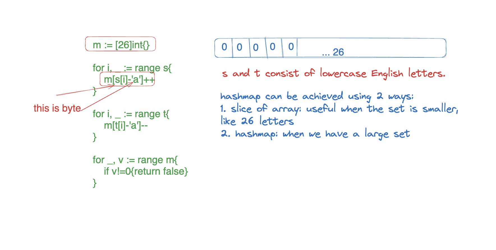

# Solving LeetCode: Valid Anagram

In this post, we will discuss how to solve the popular LeetCode problem: "Valid Anagram". This problem requires us to determine if two given strings are anagrams of each other. Two strings are anagrams if they contain the same characters with the same frequencies.

## Problem Statement

Given two strings `s` and `t`, write a function `isAnagram(s string, t string) bool` that returns `true` if `t` is an anagram of `s`, and `false` otherwise.

## Approach to Solve the Problem

We can use a hashmap to count the number of each smallcase letter frequency, and then compare with the second string
- note: it is all smallercase 
- note: use an array slice to count frequency

An illustration might help to explain this better, refer to 

### Implementation in Go

Here's the implementation of the above approach in Go:

```go
func isAnagram(s string, t string) bool {
    m := [26]int{}

    for _, v := range s {
        m[v-'a']++
    }
    for _, v := range t {
        m[v-'a']--
    }

    for _, v := range m {
        if v != 0 {
            return false
        }
    }

    return true
}
```

### Explanation of the Code

- **Initialization**: We initialize an array `m` of size 26 to zero. Each index in this array corresponds to a letter in the alphabet ('a' to 'z').

- **Counting Characters in `s`**: We iterate over each character `v` in the string `s`, calculate its position in the alphabet using `v-'a'`, and increment the corresponding index in the array `m`.

- **Counting Characters in `t`**: Similarly, we iterate over each character `v` in the string `t`, calculate its position in the alphabet, and decrement the corresponding index in the array `m`.

- **Validation**: Finally, we check if all values in the array `m` are zero. If any value is not zero, it means the strings have different character frequencies and are not anagrams.

## Conclusion

By using a frequency counter array, we efficiently determine if two strings are anagrams in linear time, O(n), where n is the length of the strings. This approach ensures that we check character frequencies in a simple and effective manner.

Happy coding!
